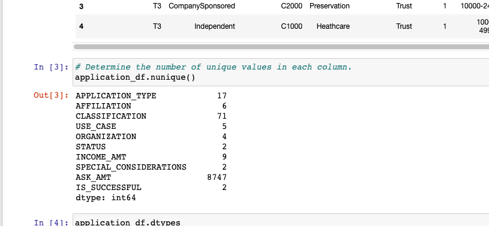
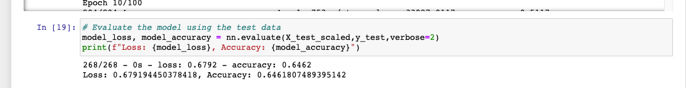

# Neural Network Charity Analysis

## Overview of the analysis: 
### Purpose: Explain the purpose of this analysis.
The purpose of this analysis is to use the knowledge of machine learning and neural networks, we will use the features in the provided dataset to help Beks create a binary classifier that is capable of predicting whether applicants will be successful if funded by Alphabet Soup.

From Alphabet Soup’s business team, received CSV containing more than 34,000 organizations that have received funding from Alphabet Soup over the years. Within this dataset are a number of columns that capture metadata about each organization,

## Results: Using bulleted lists and images to support your answers, address the following questions.

### Data Preprocessing
What variable(s) are considered the target(s) for your model? 
  - IS_SUCCESSFUL variable

What variable(s) are considered to be the features for your model?
  - 

What variable(s) are neither targets nor features, and should be removed from the input data?
  - EIN and NAME
  
### Compiling, Training, and Evaluating the Model
How many neurons, layers, and activation functions did you select for your neural network model, and why?
  - 80 neurons on first layer and 30 neurons on second layer, two layers, and used sigmoid activation function because it's meant for multiple layers.
  
Were you able to achieve the target model performance?
  - No, the closest we got was 0.65 accuracy
    
    
What steps did you take to try and increase model performance?
  - adding neurons 
  - removing noisy features/variables
  
## Summary: Summarize the overall results of the deep learning model. Include a recommendation for how a different model could solve this classification problem, and explain your recommendation.

The overall results of the deep learning model is that it will take a lot of trials to figure out the best combinations to get a high accuracy percentage. The best way so far would be removing features that have no contribution.  A reccomendation for how a different model could solve this classification problem would be adding more layers and trying other activation function. The reason this would have a higher chance of success is that having more layers gives the model a chance to collect more data to learn and compute for a better accuracy. 
